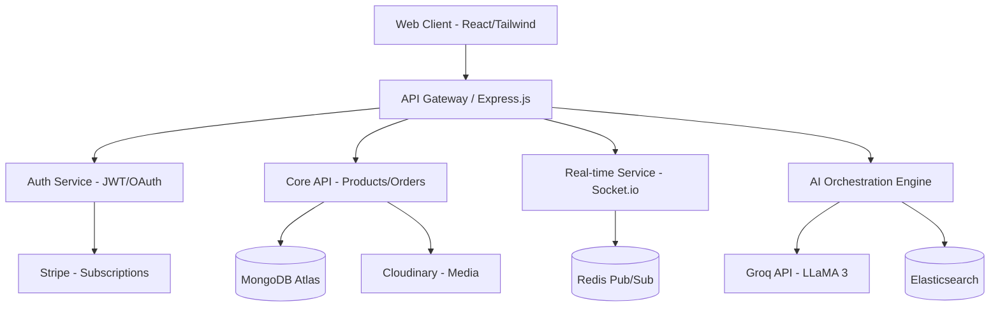

<div align="center">
  

  <h1>VendorHub AI</h1>
  <p><em>Find the Right Supplier. Faster. Smarter.</em></p>

  [](https://reactjs.org/)
  [](https://nodejs.org/)
  [](https://www.mongodb.com/)
  []()
  []()
</div>

---

## 📖 Project Overview

**VendorHub AI** is an enterprise-grade, AI-powered B2B sourcing platform designed to connect global businesses with verified suppliers, manufacturers, wholesalers, and service providers. 

Unlike traditional static supplier directories, VendorHub AI operates as an **Autonomous Procurement Workspace**. It assists procurement teams throughout the entire sourcing lifecycle—from utilizing Natural Language Processing (NLP) to discover suppliers, to intelligently comparing multi-vendor quotes, generating Requests for Quotations (RFQs), and actively negotiating terms.

---

## 🏗️ System Architecture

VendorHub AI utilizes a modern, decoupled microservices-oriented architecture designed for horizontal scalability, real-time communication, and AI inference optimization.



---

## 🚀 Core Modules & Features

The platform is divided into 17 robust modules, seamlessly integrated to support distinct user personas:

### 👔 For Buyers (Procurement Teams)
- **AI Supplier Search (NLP):** Type conversational requirements (e.g., *"Need 10,000 cotton T-shirts manufactured in Pakistan with ISO certs"*) to instantly receive AI-filtered, ranked suppliers.
- **RFQ Generator & Quote Comparison:** Automatically generate professional RFQ documents (PDF export) and utilize AI to construct side-by-side matrices comparing vendor price, MOQ, and delivery times.
- **AI Negotiation Assistant:** Context-aware AI that drafts negotiation emails, counters pricing, and requests discounts based on historical data.
- **Risk Analysis Engine:** Automatically evaluates supplier business age, missing certifications, and fraud indicators to compute a dynamic Supplier Risk Score.

### 🏭 For Vendors (Suppliers & Manufacturers)
- **Verified Vendor Profiles:** Enterprise showcases featuring factory videos, verified certifications, team details, export capacities, and rich product catalogs.
- **Order & Revenue Dashboard:** Track active orders, pending RFQs, customer requests, and holistic revenue analytics.
- **Performance Analytics:** Deep insights into RFQ conversion rates, response times, and highest-performing SKUs.

### 🛡️ Shared Infrastructure
- **Enterprise Security:** JWT-based sessions, OAuth 2.0 (Google, LinkedIn, Microsoft), Role-Based Access Control (RBAC), and Two-Factor Authentication (2FA).
- **Real-Time Communication:** Secure, Socket.io-powered messaging with read receipts, file attachments, and multi-language auto-translation.
- **Document Intelligence:** Upload, store, and AI-summarize Contracts, Invoices, Purchase Orders, and Shipping Documents.

---

## 💻 Technology Stack

### Frontend Application
* **Framework:** React.js (Vite Build Engine)
* **Styling:** Tailwind CSS, Glassmorphism UI, Custom CSS Modules
* **State Management:** React Hooks, Context API
* **PDF Engine:** Puppeteer / Native Browser Print Services

### Backend Application
* **Runtime:** Node.js v20.x
* **Framework:** Express.js (REST APIs) & FastAPI (Microservices)
* **Real-time:** Socket.io
* **Authentication:** Passport.js, JSON Web Tokens (JWT), bcrypt

### Database & Cloud Services
* **Primary Database:** MongoDB Atlas (Shared Cluster)
* **Caching & Pub/Sub:** Redis
* **Search Engine:** Elasticsearch (Full-text supplier discovery)
* **Media Storage:** Multer + Cloudinary / Amazon S3
* **Billing:** Stripe Payment Gateway

### Artificial Intelligence
* **LLM Engine:** Groq API (LLaMA 3 Models - optimized for sub-second inference)
* **Ancillary AI:** Google Gemini, specialized OCR Engines, Translation APIs

---

## ⚙️ Installation & Development Setup

### Prerequisites
* Node.js (v18.0.0 or higher)
* Git
* A MongoDB Atlas Account / Local MongoDB instance
* API Keys for Groq, Stripe, and OAuth providers.

### 1. Repository Setup
```bash
git clone <your-repository-url>
cd VendorHub-AI-
```

### 2. Environment Configuration
Navigate to the backend directory and duplicate the environment template:
```bash
cd backend
cp .env.example .env
```
Populate `.env` with your secure credentials:
```env
# Database
MONGO_URI=mongodb+srv://<user>:<password>@cluster.mongodb.net/vendorhub

# Security
JWT_SECRET=your_super_secure_jwt_secret

# Third-Party APIs
GROQ_API_KEY=gsk_your_groq_api_key
STRIPE_SECRET_KEY=sk_test_...

# OAuth Providers
GOOGLE_CLIENT_ID=...
GOOGLE_CLIENT_SECRET=...
```

### 3. Initialize Backend Services
```bash
npm install
npm run dev
```
*The REST API and Socket.io server will initialize on `http://localhost:5000`*

### 4. Initialize Frontend Application
Open a new terminal session:
```bash
cd frontend
npm install
npm run dev
```
*The Vite development server will initialize on `http://localhost:5173`*

---

## 📂 Enterprise Directory Structure

```text
VendorHub-AI-/
├── backend/
│   ├── config/          # Database and environment initializers
│   ├── controllers/     # API request handlers and business logic
│   ├── middleware/      # Auth verification, RBAC, and error handlers
│   ├── models/          # Mongoose ODM schemas (User, Order, RFQ, etc.)
│   ├── routes/          # Express route declarations
│   ├── seeders/         # Mock data injection for dev environments
│   ├── services/        # External integrations (Groq API, Stripe, Email)
│   └── index.js         # Application entry point
│
└── frontend/
    ├── src/
    │   ├── components/  # Reusable UI widgets (Modals, Cards, Navbars)
    │   ├── hooks/       # Custom React lifecycle hooks
    │   ├── pages/       # Route-level components mapped to the router
    │   ├── services/    # Client-side API wrappers and Axios interceptors
    │   ├── App.jsx      # Global Router configuration
    │   └── main.jsx     # React DOM entry point
    ├── public/          # Static assets (Favicons, static images)
    ├── tailwind.config.js
    └── package.json
```

---

## 🤝 Contribution Workflow

VendorHub AI utilizes a strict git-flow methodology to ensure code stability and minimize merge conflicts across the engineering team.

### Branching Strategy
- `main`: **Production** — Contains only highly stable, release-ready code.
- `development`: **Integration** — The active integration branch. All feature branches PR into here.
- `feature/<name>-<module>`: **Feature** — Isolated development branches (e.g., `feature/khadija-auth-dashboard`).

### Development Guidelines
1. **Schema Modifications:** Never independently edit `server/models/User.js`, `authMiddleware.js`, or core components. Propose schema changes to the project lead for centralized merging.
2. **Pull Requests:** Ensure your feature branch is up to date with `development` (`git pull origin development`) before opening a PR.
3. **Design System:** Strictly adhere to the project's Tailwind configurations and CSS variables to maintain visual consistency. Avoid inline styles unless absolutely necessary.

---

<div align="center">
  <p><strong>VendorHub AI</strong> — Empowering the future of global B2B sourcing.</p>
</div>