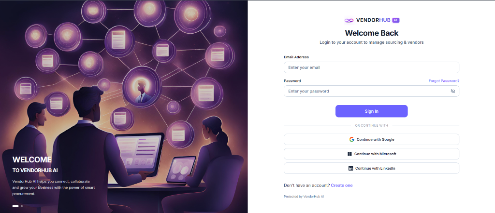
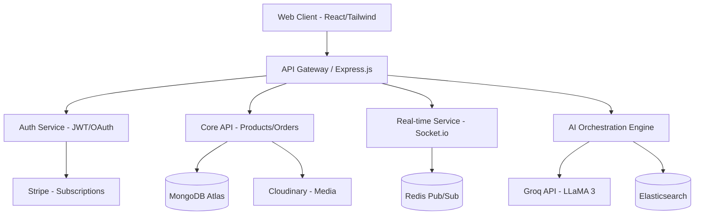

<div align="center">
  
  <br /><br />
  <h1>VendorHub AI</h1>
  <p><em>Find the Right Supplier. Faster. Smarter.</em></p>
  <p>An enterprise-grade, AI-powered B2B sourcing platform connecting global businesses with verified suppliers, manufacturers, and service providers.</p>

  [](https://reactjs.org/)
  [](https://nodejs.org/)
  [](https://www.mongodb.com/)
  []()
  []()
</div>

---

## 📖 Project Overview

**VendorHub AI** is an enterprise-grade, AI-powered B2B sourcing platform designed to connect global businesses with verified suppliers, manufacturers, wholesalers, and service providers.

Unlike traditional static supplier directories, VendorHub AI operates as an **Autonomous Procurement Workspace**. It assists procurement teams throughout the entire sourcing lifecycle — from utilizing Natural Language Processing (NLP) to discover suppliers, to intelligently comparing multi-vendor quotes, generating Requests for Quotations (RFQs), and actively negotiating terms.

The platform supports three distinct user roles — **Admin**, **Vendor**, and **Buyer** — each with tailored dashboards, permissions, and workflows secured by a robust Role-Based Access Control (RBAC) system.

---

## 🖼️ Application Preview

<div align="center">
  
  <br />
  <p><em>VendorHub AI Login — Secure authentication with Email/Password, Google, Microsoft, and LinkedIn OAuth.</em></p>
</div>

---

## 🏗️ System Architecture

VendorHub AI utilizes a modern, decoupled microservices-oriented architecture designed for horizontal scalability, real-time communication, and AI inference optimization.



---

## 🚀 Core Modules & Features

The platform is divided into **17 robust modules**, seamlessly integrated to support distinct user personas:

### 👔 For Buyers (Procurement Teams)
| Feature | Description |
|---|---|
| **AI Supplier Search (NLP)** | Type conversational requirements (e.g., *"Need 10,000 cotton T-shirts manufactured in Pakistan with ISO certs"*) to instantly receive AI-filtered, ranked suppliers. |
| **RFQ Generator & Quote Comparison** | Automatically generate professional RFQ documents (PDF export) and utilize AI to construct side-by-side matrices comparing vendor price, MOQ, and delivery times. |
| **AI Negotiation Assistant** | Context-aware AI that drafts negotiation emails, counters pricing, and requests discounts based on historical data. |
| **Risk Analysis Engine** | Evaluates supplier business age, missing certifications, and fraud indicators to compute a dynamic Supplier Risk Score. |
| **Saved Vendors & Shortlisting** | Save and organize preferred vendors into custom shortlists for quick access during future procurement cycles. |

### 🏭 For Vendors (Suppliers & Manufacturers)
| Feature | Description |
|---|---|
| **Verified Vendor Profiles** | Enterprise showcases featuring factory videos, verified certifications, team details, export capacities, and rich product catalogs. |
| **Order & Revenue Dashboard** | Track active orders, pending RFQs, customer requests, and holistic revenue analytics. |
| **Performance Analytics** | Deep insights into RFQ conversion rates, response times, and highest-performing SKUs. |
| **Product Catalog Management** | Full CRUD management over product listings with category filtering, search, and pagination support for up to thousands of SKUs. |

### 🛡️ For Admins (Platform Management)
| Feature | Description |
|---|---|
| **User Management** | View, edit, suspend, or reactivate any platform user with a full audit trail. |
| **Vendor Verification** | Review, approve, or reject vendor registration applications with compliance checks. |
| **Platform Analytics** | Holistic dashboards covering total users, active vendors, revenue metrics, and system health. |
| **All Vendors Overview** | Browse and inspect every registered vendor's complete profile, catalog, and risk assessment. |

### 🔒 Shared Infrastructure
- **Enterprise Security:** JWT-based sessions, OAuth 2.0 (Google, LinkedIn, Microsoft), Role-Based Access Control (RBAC), and Two-Factor Authentication (2FA).
- **Real-Time Communication:** Secure, Socket.io-powered messaging with read receipts, file attachments, and multi-language auto-translation.
- **Document Intelligence:** Upload, store, and AI-summarize Contracts, Invoices, Purchase Orders, and Shipping Documents.
- **Settings & Profile Management:** Each user role has a dedicated Settings page for managing account details, security preferences, notification settings, and (for vendors) company profile editing.

---

## 💻 Technology Stack

### Frontend Application
| Technology | Purpose |
|---|---|
| **React.js** (Vite Build Engine) | Core UI framework with fast HMR |
| **Tailwind CSS** + Custom CSS Modules | Styling with glassmorphism UI effects |
| **Framer Motion** | Page transitions and micro-animations |
| **Lucide React** | Consistent icon system |
| **Axios** | HTTP client with interceptors |
| **React Router v6** | Client-side routing & protected routes |

### Backend Application
| Technology | Purpose |
|---|---|
| **Node.js v20.x** | Server runtime |
| **Express.js** | REST API framework |
| **Socket.io** | Real-time bidirectional communication |
| **Passport.js + JWT + bcrypt** | Authentication & authorization |
| **Mongoose** | MongoDB ODM for data modeling |

### Database & Cloud Services
| Technology | Purpose |
|---|---|
| **MongoDB Atlas** | Primary cloud database |
| **Redis** | Caching & Pub/Sub |
| **Elasticsearch** | Full-text supplier discovery |
| **Cloudinary / S3** | Media storage |
| **Stripe** | Payment gateway |

### Artificial Intelligence
| Technology | Purpose |
|---|---|
| **Groq API (LLaMA 3)** | Primary LLM engine (sub-second inference) |
| **Google Gemini** | Ancillary AI services |
| **Custom OCR Engines** | Document digitization |

---

## ⚙️ Installation & Development Setup

### Prerequisites
* Node.js (v18.0.0 or higher)
* Git
* A MongoDB Atlas Account / Local MongoDB instance
* API Keys for Groq, Stripe, and OAuth providers.

### 1. Repository Setup
```bash
git clone <your-repository-url>
cd VendorHub-AI-
```

### 2. Environment Configuration
Navigate to the backend directory and duplicate the environment template:
```bash
cd backend
cp .env.example .env
```
Populate `.env` with your secure credentials:
```env
# Database
MONGO_URI=mongodb+srv://<user>:<password>@cluster.mongodb.net/vendorhub

# Security
JWT_SECRET=your_super_secure_jwt_secret

# Third-Party APIs
GROQ_API_KEY=gsk_your_groq_api_key
STRIPE_SECRET_KEY=sk_test_...

# OAuth Providers
GOOGLE_CLIENT_ID=...
GOOGLE_CLIENT_SECRET=...
```

### 3. Initialize Backend Services
```bash
npm install
npm run dev
```
*The REST API and Socket.io server will initialize on `http://localhost:5000`*

### 4. Initialize Frontend Application
Open a new terminal session:
```bash
cd frontend
npm install
npm run dev
```
*The Vite development server will initialize on `http://localhost:5173`*

---

## 📂 Enterprise Directory Structure

```text
VendorHub-AI-/
├── docs/
│   └── images/          # README screenshots and branding assets
│
├── backend/
│   ├── config/          # Database and environment initializers
│   ├── controllers/     # API request handlers and business logic
│   ├── middleware/      # Auth verification, RBAC, and error handlers
│   ├── models/          # Mongoose ODM schemas (User, Vendor, Product, RFQ, etc.)
│   ├── routes/          # Express route declarations
│   ├── seeders/         # Mock data injection for dev environments
│   ├── services/        # External integrations (Groq API, Stripe, Email)
│   └── index.js         # Application entry point
│
└── frontend/
    ├── src/
    │   ├── components/  # Reusable UI widgets (Modals, Cards, Navbars)
    │   ├── hooks/       # Custom React lifecycle hooks
    │   ├── pages/       # Route-level components mapped to the router
    │   ├── services/    # Client-side API wrappers and Axios interceptors
    │   ├── App.jsx      # Global Router configuration
    │   └── main.jsx     # React DOM entry point
    ├── public/          # Static assets (Favicons, static images)
    ├── tailwind.config.js
    └── package.json
```

---

## 🤝 Contribution Workflow

VendorHub AI utilizes a strict git-flow methodology to ensure code stability and minimize merge conflicts across the engineering team.

### Branching Strategy
- `main`: **Production** — Contains only highly stable, release-ready code.
- `development`: **Integration** — The active integration branch. All feature branches PR into here.
- `feature/<name>-<module>`: **Feature** — Isolated development branches (e.g., `feature/khadija-auth-dashboard`).

### Development Guidelines
1. **Schema Modifications:** Never independently edit `server/models/User.js`, `authMiddleware.js`, or core components. Propose schema changes to the project lead for centralized merging.
2. **Pull Requests:** Ensure your feature branch is up to date with `development` (`git pull origin development`) before opening a PR.
3. **Design System:** Strictly adhere to the project's Tailwind configurations and CSS variables to maintain visual consistency. Avoid inline styles unless absolutely necessary.

---

## 📜 License

This project is proprietary software developed as part of the VendorHub AI initiative. Unauthorized reproduction or distribution is prohibited.

---

<div align="center">
  
  <br />
  <p><strong>VendorHub AI</strong> — Empowering the future of global B2B sourcing.</p>
  <p><sub>Built with ❤️ using React, Node.js, MongoDB & AI</sub></p>
</div>